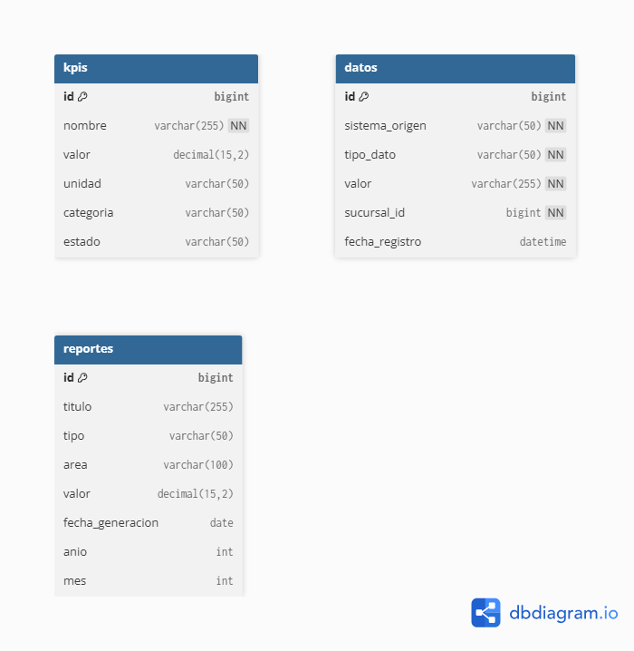

# Descripción de la Capa de Persistencia — Grupo Cordillera

**Proyecto:** Plataforma de Monitoreo Organizacional  
**Sprint:** S3 — EP3  
**Equipo:** Grupo Cordillera — Equipo de Desarrollo Backend  

---

## 1. Introducción

El sistema implementa el patrón **Database per Service** con Spring Data JPA: cada microservicio gestiona su propia base de datos MySQL de forma independiente, sin foreign keys entre bases de datos. Esto elimina el common coupling y permite que cada servicio evolucione de forma autónoma.

Los tres schemas MySQL son: \data_db\ (datos operacionales), \kpi_db\ (indicadores) y \
eport_db\ (reportes ejecutivos). Spring Data JPA implementa el patrón Repository automáticamente a partir de interfaces Java.

---

## 2. Entidades JPA

### 2.1 Dato.java (data-service → data_db.datos)

\\\java
@Entity
@Table(name = "datos")
public class Dato {
    @Id
    @GeneratedValue(strategy = GenerationType.IDENTITY)
    private Long id;

    @NotBlank
    @Column(name = "sistema_origen", nullable = false)
    private String sistemaOrigen; // SAP, POS, ERP, CRM, E-COMMERCE, INVENTARIO, FINANZAS

    @NotBlank
    private String tipoDato;

    @NotBlank
    private String valor;

    @NotNull
    private Long sucursalId;

    private LocalDateTime fechaRegistro;

    @PrePersist
    public void prePersist() {
        this.fechaRegistro = LocalDateTime.now();
    }
}
\\\

### 2.2 Kpi.java (kpi-service → kpi_db.kpis)

\\\java
@Entity
@Table(name = "kpis")
public class Kpi {
    @Id
    @GeneratedValue(strategy = GenerationType.IDENTITY)
    private Long id;

    @Column(nullable = false)
    private String nombre;

    @Column(precision = 15, scale = 2)
    private BigDecimal valor;

    private String unidad;
    private String categoria; // ventas, inventario, logistica, rentabilidad
    private String estado;
}
\\\

### 2.3 Reporte.java (report-service → report_db.reportes)

\\\java
@Entity
@Table(name = "reportes",
    uniqueConstraints = {
        @UniqueConstraint(columnNames = {"area", "tipo", "anio", "mes"})
    })
public class Reporte {
    @Id
    @GeneratedValue(strategy = GenerationType.IDENTITY)
    private Long id;

    private String titulo;
    private String tipo; // EJECUTIVO, OPERATIVO
    private String area; // Finanzas, Ventas, Logística, RRHH
    private BigDecimal valor;
    private LocalDate fechaGeneracion;
    private Integer anio;
    private Integer mes;
}
\\\

---

## 3. Repositorios Spring Data JPA

| Repositorio | Query Methods reales | SQL generado automáticamente |
| :--- | :--- | :--- |
| DatoRepository | findBySistemaOrigen(String) | SELECT * FROM datos WHERE sistema_origen = ? |
| DatoRepository | findBySucursalId(Long) | SELECT * FROM datos WHERE sucursal_id = ? |
| KpiRepository | findByCategoria(String) | SELECT * FROM kpis WHERE categoria = ? |
| ReporteRepository | findByArea(String) | SELECT * FROM reportes WHERE area = ? |
| ReporteRepository | existsByAreaAndTipoAndAnioAndMes(...) | SELECT COUNT(*) FROM reportes WHERE area=? AND tipo=? AND anio=? AND mes=? |

---

## 4. Diagrama ER

---

## 5. Patrones de Diseño en la Persistencia

- **Repository Pattern**: Spring genera implementaciones SQL a partir de interfaces Java.
- **Database per Service**: 3 schemas independientes sin FK cross-service.
- **@PrePersist**: lógica de dominio en la entidad (fecha auto-asignada).
- **@UniqueConstraint**: idempotencia garantizada a nivel de base de datos.
