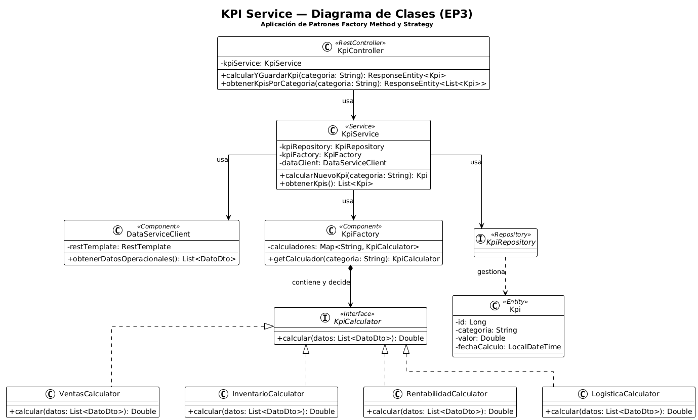
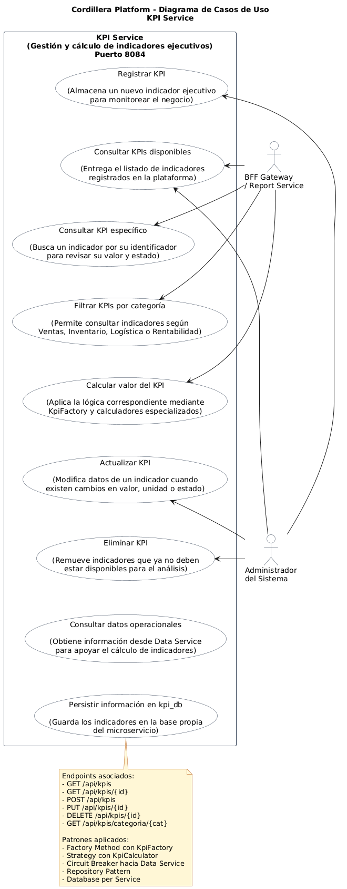

# KPI Service - Cordillera Platform

Microservicio responsable de calcular y administrar indicadores ejecutivos para Cordillera Platform.

## 1. Descripción

`kpi-service` permite registrar, consultar, actualizar, eliminar y filtrar KPIs ejecutivos. Utiliza `KpiFactory` para seleccionar calculadores especializados según la categoría del indicador.

También consume datos desde `data-service` mediante comunicación REST y protege esa llamada usando Circuit Breaker con Resilience4j.

## 2. Responsable

| Campo                 | Detalle                 |
| --------------------- | ----------------------- |
| Responsable principal | Benjamín Palma          |
| Componente            | KPI Service             |
| Rama sugerida         | `feature/kpi-service`   |
| Puerto local          | `8084`                  |
| Base de datos         | `kpi_db`                |
| URL base local        | `http://localhost:8084` |

## 3. Rol dentro de la arquitectura

```text
BFF Gateway / Report Service -> KPI Service -> Data Service
                                |
                                v
                              kpi_db
```

KPI Service entrega indicadores al BFF Gateway y al Report Service.

## 4. Stack utilizado

- Java 21
- Spring Boot 4.0.6
- Maven
- Spring Web
- Spring Data JPA
- MySQL 8.4
- Resilience4j
- JUnit 5
- Mockito
- Docker

## 5. Puerto y configuración

```properties
server.port=8084
spring.application.name=kpi-service

spring.datasource.url=${KPI_DB_URL:${DB_URL:jdbc:mysql://${DB_HOST:localhost}:${DB_PORT:3306}/kpi_db?createDatabaseIfNotExist=true&useSSL=false&serverTimezone=UTC&allowPublicKeyRetrieval=true}}
spring.datasource.username=${DB_USER:root}
spring.datasource.password=${DB_PASSWORD:}
spring.jpa.hibernate.ddl-auto=update
spring.jpa.show-sql=true

services.data.url=${DATA_SERVICE_URL:http://localhost:8083}
```

En Docker Compose, el servicio consume `data-service:8083` y se conecta a MySQL mediante `mysql:3306`.

## 6. Base de datos

| Campo             | Detalle          |
| ----------------- | ---------------- |
| Motor             | MySQL 8.4        |
| Host local Docker | `localhost:3307` |
| Puerto contenedor | `3306`           |
| Base lógica       | `kpi_db`         |
| Tabla principal   | `kpis`           |

## 7. Patrones y buenas prácticas aplicadas

| Patrón / práctica      | Aplicación                                             |
| ---------------------- | ------------------------------------------------------ |
| Factory Method         | `KpiFactory` selecciona el calculador según categoría. |
| Strategy               | `KpiCalculator` define contrato común de cálculo.      |
| Repository Pattern     | `KpiRepository` extiende `JpaRepository`.              |
| Circuit Breaker        | Protege llamadas hacia Data Service.                   |
| Database per Service   | Usa base propia `kpi_db`.                              |
| Arquitectura por capas | Controller -> Service -> Repository -> Model.          |

## 8. Clases principales

```text
KpiController
KpiService
KpiRepository
Kpi
KpiFactory
KpiCalculator
VentasCalculator
InventarioCalculator
LogisticaCalculator
RentabilidadCalculator
KpiDataLoader
```

## 9. Modelo principal

Entidad `Kpi`:

```text
id
nombre
valor
unidad
categoria
estado
```

## 10. Endpoints principales

| Método | Endpoint                    | Descripción                |
| ------ | --------------------------- | -------------------------- |
| GET    | `/api/kpis`                 | Lista todos los KPIs.      |
| POST   | `/api/kpis`                 | Registra un nuevo KPI.     |
| GET    | `/api/kpis/{id}`            | Consulta un KPI por ID.    |
| PUT    | `/api/kpis/{id}`            | Actualiza un KPI.          |
| DELETE | `/api/kpis/{id}`            | Elimina un KPI.            |
| GET    | `/api/kpis/categoria/{cat}` | Filtra KPIs por categoría. |

## 11. Circuit Breaker

KPI Service consulta Data Service para obtener datos operacionales.

```text
KPI Service -> Data Service
Circuit Breaker: dataService
```

Si Data Service no responde, se ejecuta un fallback para evitar que la plataforma completa falle.

## 12. Ejecución local

```powershell
cd .\kpi-service\
.\mvnw.cmd spring-boot:run
```

## 13. Ejecución con Docker Compose

Desde la raíz del proyecto:

```powershell
docker compose up -d --build kpi-service
```

Para levantar toda la arquitectura:

```powershell
docker compose up -d --build
```

## 14. Pruebas

```powershell
cd .\kpi-service\
.\mvnw.cmd clean test
```

## 15. Pruebas manuales

```powershell
Invoke-RestMethod -Uri "http://localhost:8084/api/kpis" -Method Get
Invoke-RestMethod -Uri "http://localhost:8084/api/kpis/categoria/Ventas" -Method Get
```

## 16. Diagramas

### Diagrama de clases



### Diagrama de casos de uso



## 17. Historias de usuario y subtareas asociadas

| Código Jira | Tipo | Nombre | Responsable | Estado | Relación con KPI Service |
|---|---|---|---|---|---|
| CORD-6 | Épica | EP-04 KPI Service Cordillera Platform | Benjamín Palma | Finalizada | Define el microservicio encargado de calcular y consultar indicadores clave de ventas, inventario, logística y rentabilidad. |
| CORD-29 | Historia de usuario | HU-KPI-01 CRUD de KPIs | Benjamín Palma | Finalizada | Implementa CRUD de KPIs mediante `Kpi`, `KpiRepository`, `KpiService` y `KpiController`. |
| CORD-30 | Historia de usuario | HU-KPI-02 Factory Method para cálculo KPI | Benjamín Palma | Finalizada | Implementa `KpiFactory`, `KpiCalculator` y calculadores especializados por categoría. |
| CORD-33 | Historia de usuario | HU-KPI-04 Circuit Breaker hacia Data Service | Benjamín Palma | Finalizada | Implementa tolerancia a fallos cuando KPI Service consume Data Service. |
| CORD-75 | Subtarea | Crear consulta KPI por categoría | Benjamín Palma | Finalizada | Implementa consulta de KPIs por categoría en `KpiRepository`, `KpiService` y `KpiController`. |

### Detalle funcional de las HU principales

**CORD-29 - HU-KPI-01 CRUD de KPIs**

Historia de usuario:

> Como gerente quiero consultar indicadores KPI para evaluar el desempeño organizacional.

Criterios de aceptación relacionados:

- Existe entidad `Kpi` con campos `id`, `nombre`, `valor`, `unidad`, `categoria` y `estado`.
- Existe `KpiRepository` extendiendo `JpaRepository`.
- Existe `KpiService` con lógica CRUD.
- Existe `KpiController` exponiendo endpoints `/api/kpis`.
- Funcionan operaciones `GET`, `POST`, `PUT` y `DELETE`.

**CORD-30 - HU-KPI-02 Factory Method para cálculo KPI**

Historia de usuario:

> Como gerente quiero calcular KPIs por categoría para obtener indicadores específicos del negocio.

Criterios de aceptación relacionados:

- Existe interfaz `KpiCalculator`.
- Existe `KpiFactory`.
- Existen `VentasCalculator`, `InventarioCalculator`, `LogisticaCalculator` y `RentabilidadCalculator`.
- Cada calculador implementa `getUnidad()`.
- `KpiService` usa `KpiFactory` para seleccionar el calculador según categoría.
- Se puede calcular KPI según categoría sin modificar la lógica central.

**CORD-33 - HU-KPI-04 Circuit Breaker hacia Data Service**

Historia de usuario:

> Como sistema quiero tolerar fallos de Data Service para evitar que el cálculo de KPIs bloquee toda la plataforma.

Criterios de aceptación relacionados:

- KPI Service consume Data Service mediante REST.
- Se usa anotación `@CircuitBreaker` de Resilience4j en la capa Service.
- Existe `fallbackMethod` funcional.
- Si Data Service falla, KPI Service responde de forma degradada y controlada.
- Se documentan estados `CLOSED`, `OPEN` y `HALF-OPEN` para la defensa oral.

Estas historias y subtareas permiten vincular la implementación técnica de KPI Service con la planificación y seguimiento del proyecto en Jira.

## 18. Evidencias relacionadas

- Servicio operativo en `http://localhost:8084`.
- Endpoint `/api/kpis` validado.
- KPIs visibles en el dashboard ejecutivo mediante BFF Gateway.
- Persistencia independiente en `kpi_db`.
- Datos semilla cargados mediante `KpiDataLoader`.
- Circuit Breaker documentado para la comunicación con Data Service.
